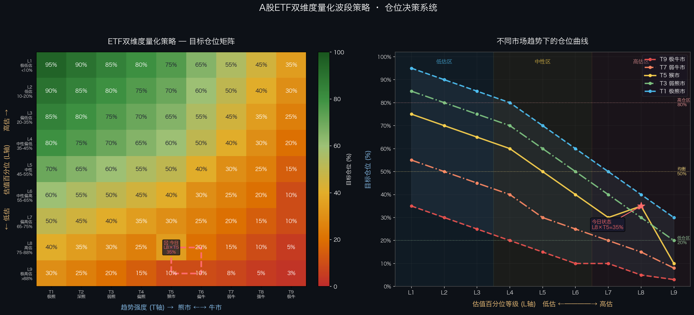

# A股ETF双维度量化波段策略

> **自动化程度**：每日定时运行 · ADB自动下单 · Telegram播报

一套基于**PE估值百分位 × 市场趋势强度**的A股ETF宽基波段策略，集成宏观定仓、行业轮动、持仓管理三层架构，支持ADB自动下单。

---

## 📊 核心策略：二维坐标系

策略的核心思想是：**市场估值（便宜还是贵）× 市场趋势（牛还是熊）共同决定仓位**。

### 二维坐标系示意

```
仓位决策矩阵 (目标仓位%)
        ←——— 趋势强度 (T轴) ———→
        T1    T2    T3    T4    T5    T6    T7    T8    T9
        极熊  深熊  弱熊  偏熊  猴市  偏牛  弱牛  强牛  极牛
      ┌─────┬─────┬─────┬─────┬─────┬─────┬─────┬─────┬─────┐
  L1  │ 95% │ 90% │ 85% │ 80% │ 75% │ 65% │ 55% │ 45% │ 35% │ ← 极度低估(<10%位)
  极低│─────┼─────┼─────┼─────┼─────┼─────┼─────┼─────┼─────┤
  估  │ 90% │ 85% │ 80% │ 75% │ 70% │ 60% │ 50% │ 40% │ 30% │
  ↕  L2─────┼─────┼─────┼─────┼─────┼─────┼─────┼─────┼─────┤ 低估
 估  │ 85% │ 80% │ 75% │ 70% │ 65% │ 55% │ 45% │ 35% │ 25% │
  值 L3─────┼─────┼─────┼─────┼─────┼─────┼─────┼─────┼─────┤ 偏低估
  百 │ 80% │ 75% │ 70% │ 65% │ 60% │ 50% │ 40% │ 30% │ 20% │
  分 L4─────┼─────┼─────┼─────┼─────┼─────┼─────┼─────┼─────┤ 中性偏低
  位 │ 70% │ 65% │ 60% │ 55% │ 50% │ 40% │ 30% │ 25% │ 15% │
  (L│ L5─────┼─────┼─────┼─────┼─────┼─────┼─────┼─────┼─────┤ 中性
  轴 │ 60% │ 55% │ 50% │ 45% │ 40% │ 30% │ 25% │ 20% │ 10% │
  ) L6─────┼─────┼─────┼─────┼─────┼─────┼─────┼─────┼─────┤ 中性偏高
     │ 50% │ 45% │ 40% │ 35% │ 30% │ 25% │ 20% │ 15% │ 10% │
  高 L7─────┼─────┼─────┼─────┼─────┼─────┼─────┼─────┼─────┤ 偏高估
  估 │ 40% │ 35% │ 30% │ 25% │ 35% │ 20% │ 15% │ 10% │  5% │
  ↕  L8─────┼─────┼─────┼─────┼─────┼─────┼─────┼─────┼─────┤ 高估 ← 今日(35%)
     │ 30% │ 25% │ 20% │ 15% │ 10% │ 10% │  8% │  5% │  3% │
  L9 └─────┴─────┴─────┴─────┴─────┴─────┴─────┴─────┴─────┘ 极度高估(>88%位)
```

### 仓位曲线规律

不同市场趋势下，仓位随估值变化的曲线特征：

```
目标仓位%
100% |
 95% |●─────  T1极熊市 (估值越低越重仓，逢熊抄底)
 90% | ╲
 85% |  ╲─●  T3弱熊市
 80% |    ╲
 70% |     ╲─────●  T5猴市 (均衡配置，跟随估值)
 60% |          ╲
 50% |           ╲──●  T7弱牛市
 40% |              ╲
 35% |               ╲────────────●  T9极牛市 (高估时保守，严控风险)
 20% |
 10% |
  3% |                            ●  L9×T9 = 最低仓位
     └────────────────────────────────────────────
      L1    L2    L3    L4    L5    L6    L7    L8    L9
    极低估                   中性                  极高估
    
▶ 今日状态：L8(PE=81.8%位) × T5(猴市) = 35%
```

### 策略逻辑

| 场景 | 估值 | 趋势 | 策略 | 目标仓位 |
|------|------|------|------|---------|
| 🟢 最佳买入 | 极度低估(L1-L2) | 牛市(T7-T9) | 重仓持有 | 55-95% |
| 🟢 超跌抄底 | 极度低估(L1-L2) | 熊市(T1-T3) | 逆势建仓 | 85-95% |
| 🟡 均衡配置 | 中性(L4-L6) | 猴市(T5) | 跟随趋势 | 40-60% |
| 🟡 谨慎持有 | 高估(L7-L8) | 牛市偏强 | 控制仓位 | 10-30% |
| 🔴 高危减仓 | 极度高估(L9) | 牛市(T7-T9) | 大幅减仓 | 3-8% |
| 🔴 极度防御 | 极度高估(L9) | 熊市(T1) | 底仓保留 | 30% |

---

## 🏗️ 三层架构

```
┌────────────────────────────────────────────────┐
│         综合ETF量化策略 (comprehensive_strategy.py)       │
├────────────────────────────────────────────────┤
│  Layer 1: 宏观定仓                              │
│  ┌─────────────────────────────────────────┐   │
│  │ A股整体PE百分位 → L1-L9 估值等级         │   │
│  │ 趋势强度(RSI/均线/动量) → T1-T9 趋势等级 │   │
│  │ 9×9矩阵查表 → 目标仓位%                  │   │
│  └─────────────────────────────────────────┘   │
│                    ↓                           │
│  Layer 2: 行业轮动 v2                           │
│  ┌─────────────────────────────────────────┐   │
│  │ 申万行业PE百分位(全历史，2011-)           │   │
│  │ 3个月价格动量因子 (权重30%)              │   │
│  │ 6个月价格动量因子 (权重25%)              │   │
│  │ PE低估评分 (权重45%)                    │   │
│  │ Top 5 行业推荐                          │   │
│  └─────────────────────────────────────────┘   │
│                    ↓                           │
│  Layer 3: 持仓管理                             │
│  ┌─────────────────────────────────────────┐   │
│  │ 实时PnL跟踪 (腾讯行情API)                │   │
│  │ 止盈线: +2% | 止损线: -3%               │   │
│  │ 日亏损上限: 500元                        │   │
│  │ 仓位偏离预警                            │   │
│  └─────────────────────────────────────────┘   │
└────────────────────────────────────────────────┘
```

---

## 📐 估值分级 (L轴)

| 等级 | PE百分位 | 含义 | 颜色 |
|------|---------|------|------|
| L1 | < 10% | 极度低估 | 🟢🟢 |
| L2 | 10-20% | 低估 | 🟢🟢 |
| L3 | 20-35% | 偏低估 | 🟢 |
| L4 | 35-45% | 中性偏低 | 🟡 |
| L5 | 45-55% | 中性 | 🟡 |
| L6 | 55-65% | 中性偏高 | 🟠 |
| L7 | 65-75% | 偏高估 | 🟠 |
| L8 | 75-88% | 高估 | 🔴 |
| L9 | > 88% | 极度高估 | 🔴🔴 |

> 数据来源：Wind全A指数PE TTM，回测历史 2005-至今

---

## 📈 趋势分级 (T轴)

| 等级 | 趋势指标综合 | RSI参考 | 含义 |
|------|-----------|---------|------|
| T1 | < 1.5 | < 20 | 极度熊市 |
| T2 | 1.5-2.5 | 20-30 | 深度熊市 |
| T3 | 2.5-3.5 | 30-40 | 弱熊市 |
| T4 | 3.5-4.5 | 40-45 | 偏熊市 |
| T5 | 4.5-5.5 | 45-55 | 猴市（震荡）|
| T6 | 5.5-6.5 | 55-60 | 偏牛市 |
| T7 | 6.5-7.5 | 60-70 | 弱牛市 |
| T8 | 7.5-8.5 | 70-80 | 强牛市 |
| T9 | > 8.5 | > 80 | 极度牛市 |

> 趋势得分综合：RSI(20日)、均线排列(5/10/20/60日)、指数3月涨跌幅

---

## 🔄 行业轮动评分公式 (v2)

```
综合评分 = 45% × PE低估得分 + 30% × 3月动量得分 + 25% × 6月动量得分

PE低估得分：(1 - PE百分位) × 100
  → PE越低 → 分数越高

动量得分：min(max((涨幅 + 20) / 40 × 100, 0), 100)
  → 涨幅-20%得0分，涨幅0%得50分，涨幅+20%得100分
```

| 行业 | ETF | 当前PE | PE百分位 | 3M涨幅 | 6M涨幅 | 综合评分 |
|------|-----|--------|---------|--------|--------|---------|
| 公用事业 | 516880 | 20.7x | 47% | +15.6% | +17.1% | 74.8 🟢🟢 |
| 煤炭 | 515220 | 20.6x | 58% | +24.4% | +24.3% | 73.4 🟢🟢 |
| 农林牧渔 | 516550 | 23.7x | 17% | +2.7% | +7.5% | 71.5 🟢🟢 |
| 银行 | 512800 | 5.9x | 31% | -2.4% | +3.2% | 58.0 🟡 |
| 非银金融 | 512070 | 12.8x | 6% | -9.6% | -4.1% | 57.9 🟡 |

> 以上为2026-03-19示例数据

---

## 📁 文件结构

```
etf-trader/
├── comprehensive_strategy.py   # 综合策略主程序 ⭐
├── etf_quant_strategy.py       # 双维度宏观定仓模块
├── sector_rotation_strategy.py # 行业轮动（旧版，仅参考）
├── etf_monitor.py              # ETF实盘监控
├── jty_auto_trade.py           # 国信证券ADB自动下单
├── xueqiu_auto_post.py         # 雪球自动发帖
├── generate_strategy_chart.py  # 策略矩阵可视化
├── strategy_matrix.png         # 策略矩阵图 ⭐
└── sector_cache/               # 申万PE数据缓存
```

---

## 🚀 快速使用

```bash
# 完整策略分析（含三层输出）
python3 comprehensive_strategy.py

# 简洁版（适合Telegram播报）
python3 comprehensive_strategy.py --brief

# 仅行业轮动
python3 comprehensive_strategy.py --sector

# Top N行业（默认5）
python3 comprehensive_strategy.py --top=3

# 优化版回测
python3 comprehensive_strategy.py --backtest

# JSON格式输出（供其他程序调用）
python3 comprehensive_strategy.py --json

# 强制刷新缓存
python3 comprehensive_strategy.py --no-cache
```

---

## ⚙️ 配置参数

在 `comprehensive_strategy.py` 顶部修改：

```python
# 持仓配置
POSITIONS = {
    '510500': {'name': '中证500ETF', 'shares': 1800, 'cost': 8.116},
    '159915': {'name': '创业板ETF',  'shares': 4500, 'cost': 3.289},
}

TOTAL_CAPITAL    = 50000   # 总资金（元）
STOP_PROFIT_PCT  = 0.02    # 止盈线 +2%
STOP_LOSS_PCT    = 0.03    # 止损线 -3%
DAILY_LOSS_LIMIT = 500     # 日亏损上限（元）
```

---

## 📅 每日自动化流程

| 时间 | 任务 | 脚本 |
|------|------|------|
| 08:30 | 盘前信息总结（美股+A股资讯） | Telegram手动 |
| 09:00 | ETF操作建议 | `etf_quant_strategy.py` |
| 09:30 | ADB自动下单 | `jty_auto_trade.py` |
| 15:15 | 收盘复盘 | `etf_monitor.py evening` |
| 15:30 | 盘后总结 + 中概股点评 | Telegram手动 |

---

## 📊 策略矩阵可视化

运行以下命令生成策略矩阵图（需要matplotlib）：

```bash
pip3 install matplotlib
python3 generate_strategy_chart.py
# 输出: strategy_matrix.png
```



---

## ⚠️ 风险提示

- 本策略为个人量化研究工具，**不构成投资建议**
- 历史回测不代表未来收益
- ETF投资有市场风险，请根据自身风险承受能力操作
- 止损规则请严格执行，单日亏损超过上限应暂停交易

---

## 📝 版本记录

| 版本 | 日期 | 更新内容 |
|------|------|---------|
| v1.0 | 2026-03-19 | 综合策略三层架构，行业轮动v2（全历史PE+动量因子） |
| - | 2026-03 | 双维度量化策略原版（PE%位 × 趋势强度 9×9矩阵） |
| - | 2026-02 | ETF监控系统基础版 |

---

*由 VisionClaw AI 代理维护 · Sarah Mitchell · sarahmitchell@visionclaw.dev*
